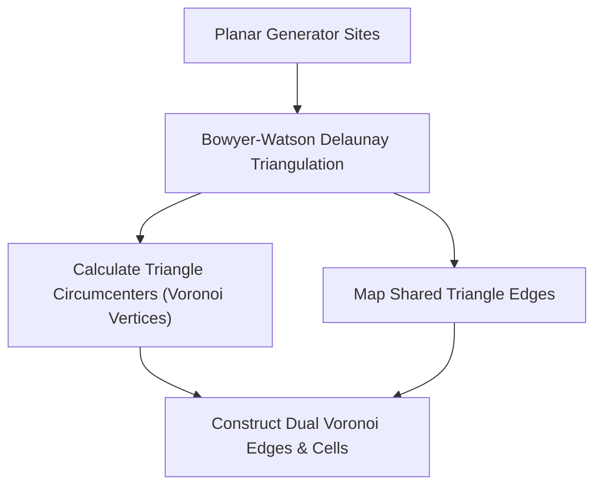

# genpark-voronoi-diagram-delaunay-dual-skill

Agent Skill implementing **Voronoi Diagram construction from Delaunay Triangulation dual graphs**, computing circumcenters and orthogonal bisector adjacency.

## Architectural Overview

